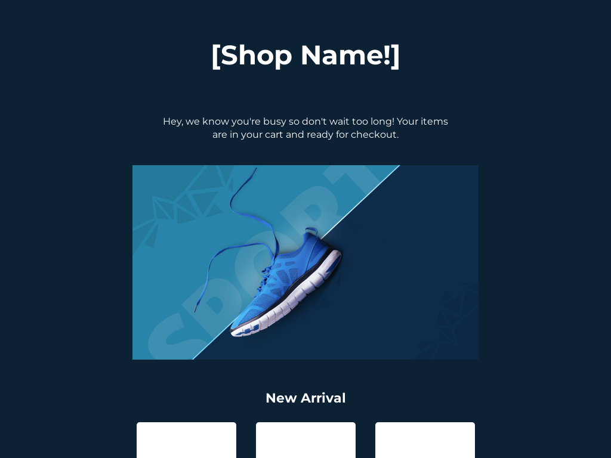
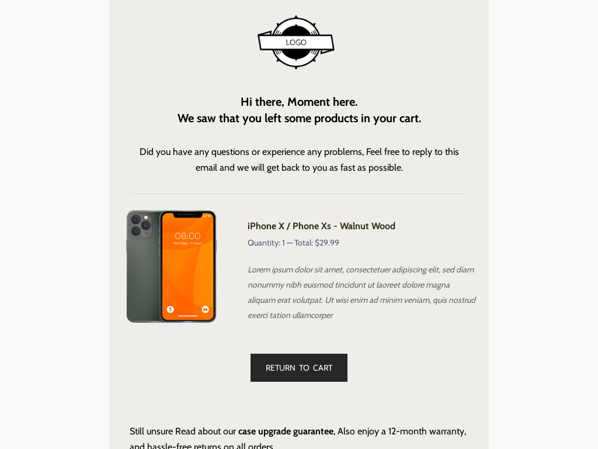
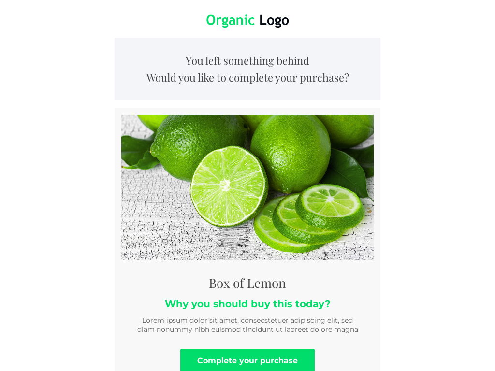

# Templates for Category: Abandoned cart

## Template: You Forgot to Order
- **File Name**: you-forgot-to-order.html

### Template Collection Description
This collection of email templates is designed to offer flexibility and creativity for your email campaigns. Each template is structured for ease of use and compatibility with modern email clients. Ideal for businesses, marketers, and developers looking for customizable solutions.

These templates were created by **Stefan**, founder at [LaravelMail](https://laravelmail.com).

# Templates for Category: Abandoned cart

## Template: Hanukkah Sale
- **File Name**: hanukkah-sale.html

### Template Collection Description
This collection of email templates is designed to offer flexibility and creativity for your email campaigns. Each template is structured for ease of use and compatibility with modern email clients. Ideal for businesses, marketers, and developers looking for customizable solutions.

These templates were created by **Stefan**, founder at [LaravelMail](https://laravelmail.com).

# Templates for Category: Abandoned cart

## Template: SaaS Cart Abandoned
- **File Name**: saas-cart-abandoned.html

### Template Collection Description
This collection of email templates is designed to offer flexibility and creativity for your email campaigns. Each template is structured for ease of use and compatibility with modern email clients. Ideal for businesses, marketers, and developers looking for customizable solutions.

These templates were created by **Stefan**, founder at [LaravelMail](https://laravelmail.com).

# Templates for Category: Abandoned cart

## Template: Customer Feedback
- **File Name**: customer-feedback.html

### Template Collection Description
This collection of email templates is designed to offer flexibility and creativity for your email campaigns. Each template is structured for ease of use and compatibility with modern email clients. Ideal for businesses, marketers, and developers looking for customizable solutions.

These templates were created by **Stefan**, founder at [LaravelMail](https://laravelmail.com).

# Templates for Category: Abandoned cart

## Template: One Day Offer
- **File Name**: one-day-offer.html

### Template Collection Description
This collection of email templates is designed to offer flexibility and creativity for your email campaigns. Each template is structured for ease of use and compatibility with modern email clients. Ideal for businesses, marketers, and developers looking for customizable solutions.

These templates were created by **Stefan**, founder at [LaravelMail](https://laravelmail.com).

# Templates for Category: Abandoned cart

## Template: Abandoned Cart Reminder
- **File Name**: abandoned-cart-reminder.html

### Template Collection Description
This collection of email templates is designed to offer flexibility and creativity for your email campaigns. Each template is structured for ease of use and compatibility with modern email clients. Ideal for businesses, marketers, and developers looking for customizable solutions.

These templates were created by **Stefan**, founder at [LaravelMail](https://laravelmail.com).

# Templates for Category: Abandoned cart

## Template: Return Product
- **File Name**: return-product-to-cart.html

### Template Collection Description
This collection of email templates is designed to offer flexibility and creativity for your email campaigns. Each template is structured for ease of use and compatibility with modern email clients. Ideal for businesses, marketers, and developers looking for customizable solutions.

These templates were created by **Stefan**, founder at [LaravelMail](https://laravelmail.com).

# Templates for Category: Abandoned cart

## Template: Abandoned Cart
- **File Name**: abandoned-cart.html

### Template Collection Description
This collection of email templates is designed to offer flexibility and creativity for your email campaigns. Each template is structured for ease of use and compatibility with modern email clients. Ideal for businesses, marketers, and developers looking for customizable solutions.

These templates were created by **Stefan**, founder at [LaravelMail](https://laravelmail.com).

