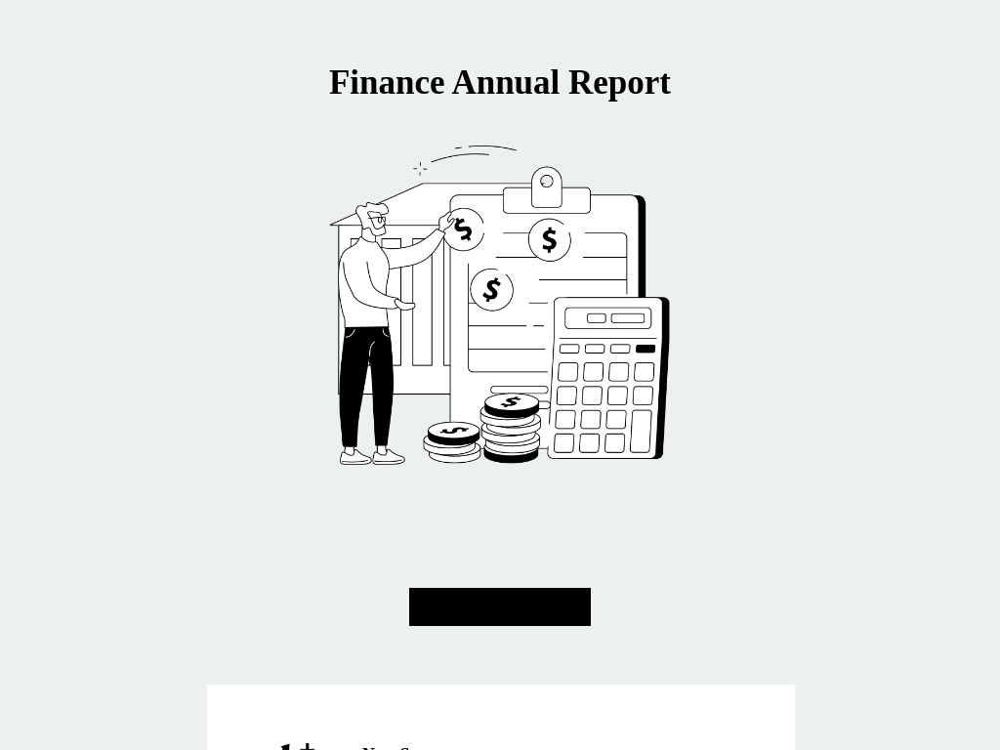

# Templates for Category: Annual review

## Template: Finance Annual Report 
- **File Name**: finance-annual-report.html

### Template Collection Description
This collection of email templates is designed to offer flexibility and creativity for your email campaigns. Each template is structured for ease of use and compatibility with modern email clients. Ideal for businesses, marketers, and developers looking for customizable solutions.

These templates were created by **Stefan**, founder at [LaravelMail](https://laravelmail.com).

# Templates for Category: Annual review

## Template: Passenger Review
- **File Name**: passenger-review.html

### Template Collection Description
This collection of email templates is designed to offer flexibility and creativity for your email campaigns. Each template is structured for ease of use and compatibility with modern email clients. Ideal for businesses, marketers, and developers looking for customizable solutions.

These templates were created by **Stefan**, founder at [LaravelMail](https://laravelmail.com).

# Templates for Category: Annual review

## Template: User Review
- **File Name**: user-review.html

### Template Collection Description
This collection of email templates is designed to offer flexibility and creativity for your email campaigns. Each template is structured for ease of use and compatibility with modern email clients. Ideal for businesses, marketers, and developers looking for customizable solutions.

These templates were created by **Stefan**, founder at [LaravelMail](https://laravelmail.com).

# Templates for Category: Annual review

## Template: Investor Update
- **File Name**: investor-update.html

### Template Collection Description
This collection of email templates is designed to offer flexibility and creativity for your email campaigns. Each template is structured for ease of use and compatibility with modern email clients. Ideal for businesses, marketers, and developers looking for customizable solutions.

These templates were created by **Stefan**, founder at [LaravelMail](https://laravelmail.com).

# Templates for Category: Annual review

## Template: Annual Review
- **File Name**: review-template.html

### Template Collection Description
This collection of email templates is designed to offer flexibility and creativity for your email campaigns. Each template is structured for ease of use and compatibility with modern email clients. Ideal for businesses, marketers, and developers looking for customizable solutions.

These templates were created by **Stefan**, founder at [LaravelMail](https://laravelmail.com).

