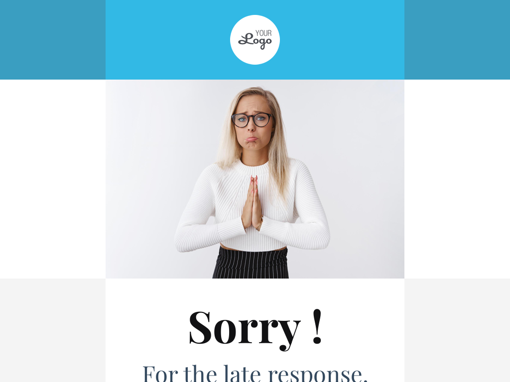
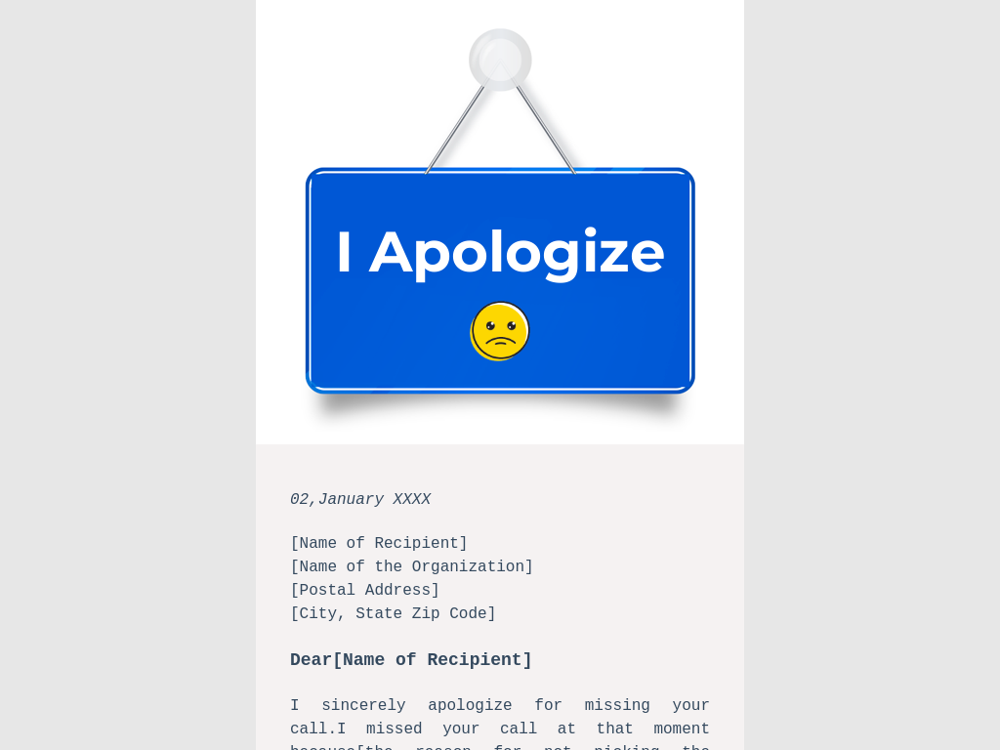
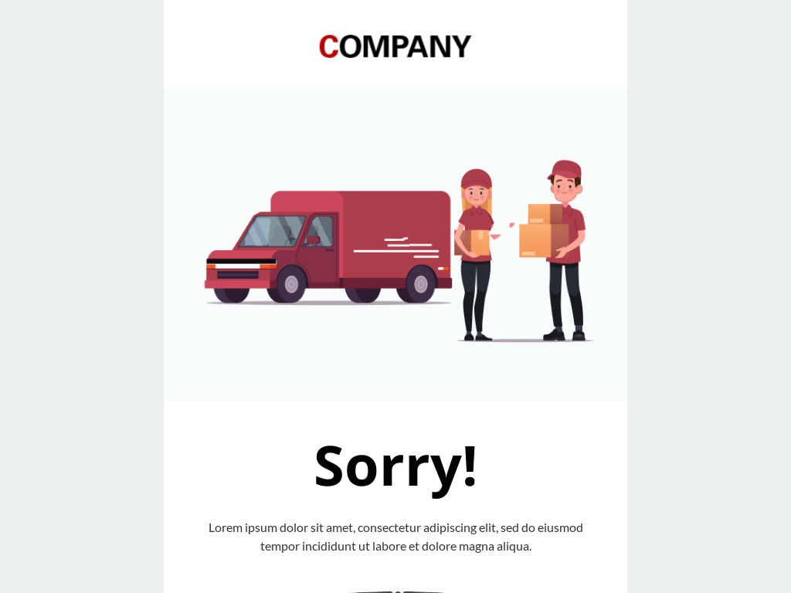
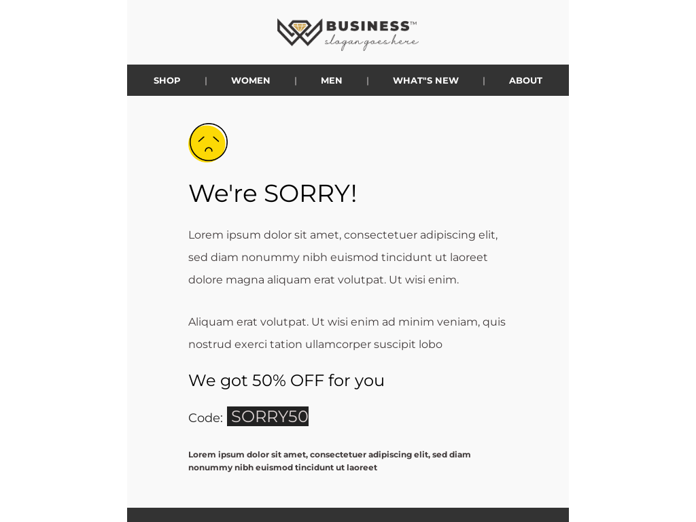

# Templates for Category: Apology

## Template: Apology For Cancellation Of Meeting
- **File Name**: apology-for-cancellation-of-meeting.html

### Template Collection Description
This collection of email templates is designed to offer flexibility and creativity for your email campaigns. Each template is structured for ease of use and compatibility with modern email clients. Ideal for businesses, marketers, and developers looking for customizable solutions.

These templates were created by **Stefan**, founder at [LaravelMail](https://laravelmail.com).

# Templates for Category: Apology

## Template: Apology For Late Customer Response
- **File Name**: apology-for-late-customer-response.html

### Template Collection Description
This collection of email templates is designed to offer flexibility and creativity for your email campaigns. Each template is structured for ease of use and compatibility with modern email clients. Ideal for businesses, marketers, and developers looking for customizable solutions.

These templates were created by **Stefan**, founder at [LaravelMail](https://laravelmail.com).

# Templates for Category: Apology

## Template: Apology For Not Attending Call
- **File Name**: apology-for-not-attending-call.html

### Template Collection Description
This collection of email templates is designed to offer flexibility and creativity for your email campaigns. Each template is structured for ease of use and compatibility with modern email clients. Ideal for businesses, marketers, and developers looking for customizable solutions.

These templates were created by **Stefan**, founder at [LaravelMail](https://laravelmail.com).

# Templates for Category: Apology

## Template: Apology To Boss For Mistake
- **File Name**: apology-to-boss-for-mistake.html

### Template Collection Description
This collection of email templates is designed to offer flexibility and creativity for your email campaigns. Each template is structured for ease of use and compatibility with modern email clients. Ideal for businesses, marketers, and developers looking for customizable solutions.

These templates were created by **Stefan**, founder at [LaravelMail](https://laravelmail.com).

# Templates for Category: Apology

## Template: Apology To Customer For Delay In Delivery
- **File Name**: apology-to-customer-for-delay-in-delivery.html

### Template Collection Description
This collection of email templates is designed to offer flexibility and creativity for your email campaigns. Each template is structured for ease of use and compatibility with modern email clients. Ideal for businesses, marketers, and developers looking for customizable solutions.

These templates were created by **Stefan**, founder at [LaravelMail](https://laravelmail.com).

# Templates for Category: Apology

## Template: Apology to Fellow Colleague
- **File Name**: apology-to-fellow-colleague.html

### Template Collection Description
This collection of email templates is designed to offer flexibility and creativity for your email campaigns. Each template is structured for ease of use and compatibility with modern email clients. Ideal for businesses, marketers, and developers looking for customizable solutions.

These templates were created by **Stefan**, founder at [LaravelMail](https://laravelmail.com).

# Templates for Category: Apology

## Template: Apology to Ecommerce Customer
- **File Name**: apology-to-ecommerce-customer.html

### Template Collection Description
This collection of email templates is designed to offer flexibility and creativity for your email campaigns. Each template is structured for ease of use and compatibility with modern email clients. Ideal for businesses, marketers, and developers looking for customizable solutions.

These templates were created by **Stefan**, founder at [LaravelMail](https://laravelmail.com).

# Templates for Category: Apology

## Template: Apology to Automobile Customer
- **File Name**: apology-to-automobile-customer.html

### Template Collection Description
This collection of email templates is designed to offer flexibility and creativity for your email campaigns. Each template is structured for ease of use and compatibility with modern email clients. Ideal for businesses, marketers, and developers looking for customizable solutions.

These templates were created by **Stefan**, founder at [LaravelMail](https://laravelmail.com).

# Templates for Category: Apology

## Template: Apology Email to Company Boss
- **File Name**: apology-email-to-company-boss.html

### Template Collection Description
This collection of email templates is designed to offer flexibility and creativity for your email campaigns. Each template is structured for ease of use and compatibility with modern email clients. Ideal for businesses, marketers, and developers looking for customizable solutions.

These templates were created by **Stefan**, founder at [LaravelMail](https://laravelmail.com).

# Templates for Category: Apology

## Template: Apology For Not Attending Meeting
- **File Name**: apology-for-not-attending-meeting.html

### Template Collection Description
This collection of email templates is designed to offer flexibility and creativity for your email campaigns. Each template is structured for ease of use and compatibility with modern email clients. Ideal for businesses, marketers, and developers looking for customizable solutions.

These templates were created by **Stefan**, founder at [LaravelMail](https://laravelmail.com).

# Templates for Category: Apology

## Template: Apology For Sending Wrong Email
- **File Name**: apology-for-sending-wrong-email.html

### Template Collection Description
This collection of email templates is designed to offer flexibility and creativity for your email campaigns. Each template is structured for ease of use and compatibility with modern email clients. Ideal for businesses, marketers, and developers looking for customizable solutions.

These templates were created by **Stefan**, founder at [LaravelMail](https://laravelmail.com).

# Templates for Category: Apology

## Template: Apology For Late Payment To Supplier
- **File Name**: apology-for-late-payment-to-supplier.html

### Template Collection Description
This collection of email templates is designed to offer flexibility and creativity for your email campaigns. Each template is structured for ease of use and compatibility with modern email clients. Ideal for businesses, marketers, and developers looking for customizable solutions.

These templates were created by **Stefan**, founder at [LaravelMail](https://laravelmail.com).

# Templates for Category: Apology

## Template: Apology For Not Attending Interview
- **File Name**: apology-for-not-attending-interview.html

### Template Collection Description
This collection of email templates is designed to offer flexibility and creativity for your email campaigns. Each template is structured for ease of use and compatibility with modern email clients. Ideal for businesses, marketers, and developers looking for customizable solutions.

These templates were created by **Stefan**, founder at [LaravelMail](https://laravelmail.com).

# Templates for Category: Apology

## Template: Formal Business Apology
- **File Name**: formal-business-apology.html

### Template Collection Description
This collection of email templates is designed to offer flexibility and creativity for your email campaigns. Each template is structured for ease of use and compatibility with modern email clients. Ideal for businesses, marketers, and developers looking for customizable solutions.

These templates were created by **Stefan**, founder at [LaravelMail](https://laravelmail.com).

# Templates for Category: Apology

## Template: Restaurant Bad Service Apology
- **File Name**: restaurant-bad-service-apology.html

### Template Collection Description
This collection of email templates is designed to offer flexibility and creativity for your email campaigns. Each template is structured for ease of use and compatibility with modern email clients. Ideal for businesses, marketers, and developers looking for customizable solutions.

These templates were created by **Stefan**, founder at [LaravelMail](https://laravelmail.com).

