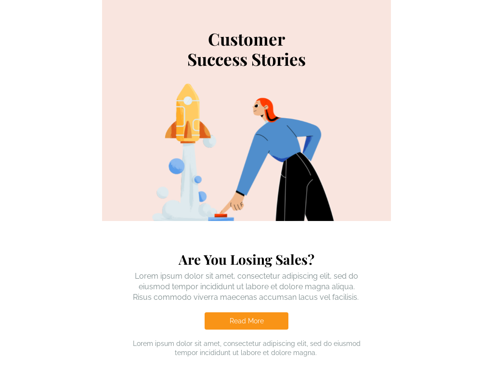

# Templates for Category: B2b

## Template: Storytelling with Infographics
- **File Name**: storytelling-with-infographics.html

### Template Collection Description
This collection of email templates is designed to offer flexibility and creativity for your email campaigns. Each template is structured for ease of use and compatibility with modern email clients. Ideal for businesses, marketers, and developers looking for customizable solutions.

These templates were created by **Stefan**, founder at [LaravelMail](https://laravelmail.com).

# Templates for Category: B2b

## Template: Looking Back
- **File Name**: looking-back.html

### Template Collection Description
This collection of email templates is designed to offer flexibility and creativity for your email campaigns. Each template is structured for ease of use and compatibility with modern email clients. Ideal for businesses, marketers, and developers looking for customizable solutions.

These templates were created by **Stefan**, founder at [LaravelMail](https://laravelmail.com).

# Templates for Category: B2b

## Template: Thought Leadership
- **File Name**: thought-leadership.html

### Template Collection Description
This collection of email templates is designed to offer flexibility and creativity for your email campaigns. Each template is structured for ease of use and compatibility with modern email clients. Ideal for businesses, marketers, and developers looking for customizable solutions.

These templates were created by **Stefan**, founder at [LaravelMail](https://laravelmail.com).

# Templates for Category: B2b

## Template: Customer Success Stories
- **File Name**: customer-success-stories.html

### Template Collection Description
This collection of email templates is designed to offer flexibility and creativity for your email campaigns. Each template is structured for ease of use and compatibility with modern email clients. Ideal for businesses, marketers, and developers looking for customizable solutions.

These templates were created by **Stefan**, founder at [LaravelMail](https://laravelmail.com).

# Templates for Category: B2b

## Template: Book a Demo
- **File Name**: book-a-demo.html

### Template Collection Description
This collection of email templates is designed to offer flexibility and creativity for your email campaigns. Each template is structured for ease of use and compatibility with modern email clients. Ideal for businesses, marketers, and developers looking for customizable solutions.

These templates were created by **Stefan**, founder at [LaravelMail](https://laravelmail.com).

# Templates for Category: B2b

## Template: Client Acquisition
- **File Name**: client-acquisition.html

### Template Collection Description
This collection of email templates is designed to offer flexibility and creativity for your email campaigns. Each template is structured for ease of use and compatibility with modern email clients. Ideal for businesses, marketers, and developers looking for customizable solutions.

These templates were created by **Stefan**, founder at [LaravelMail](https://laravelmail.com).

# Templates for Category: B2b

## Template: Our New Updates
- **File Name**: our-new-updates.html

### Template Collection Description
This collection of email templates is designed to offer flexibility and creativity for your email campaigns. Each template is structured for ease of use and compatibility with modern email clients. Ideal for businesses, marketers, and developers looking for customizable solutions.

These templates were created by **Stefan**, founder at [LaravelMail](https://laravelmail.com).

# Templates for Category: B2b

## Template: B2B Marketing
- **File Name**: b2b-marketing.html

### Template Collection Description
This collection of email templates is designed to offer flexibility and creativity for your email campaigns. Each template is structured for ease of use and compatibility with modern email clients. Ideal for businesses, marketers, and developers looking for customizable solutions.

These templates were created by **Stefan**, founder at [LaravelMail](https://laravelmail.com).

