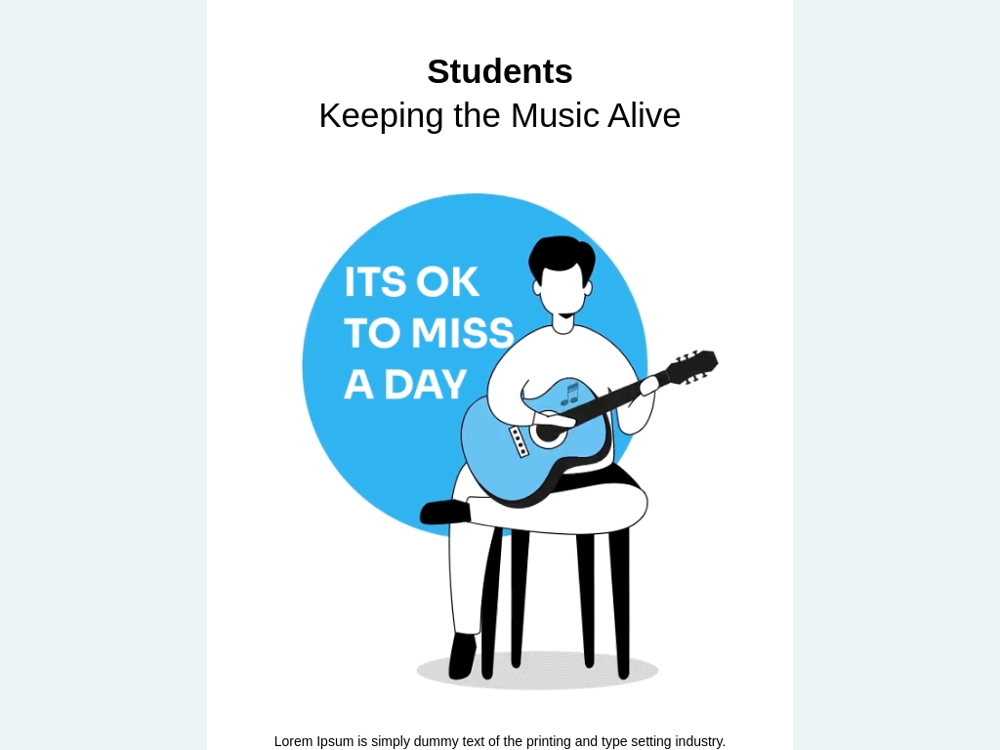
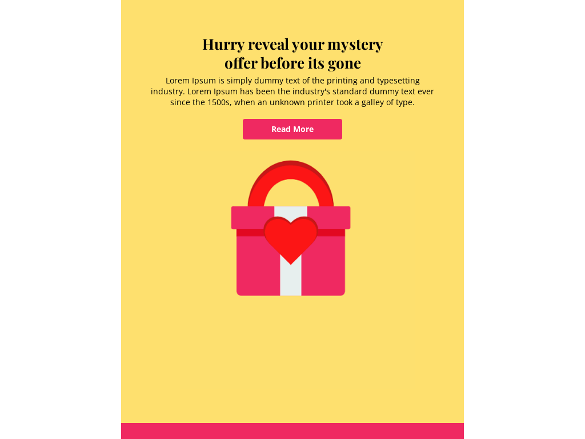

# Templates for Category: Back to school

## Template: School Supplies Sale
- **File Name**: school-supplies-sale.html

### Template Collection Description
This collection of email templates is designed to offer flexibility and creativity for your email campaigns. Each template is structured for ease of use and compatibility with modern email clients. Ideal for businesses, marketers, and developers looking for customizable solutions.

These templates were created by **Stefan**, founder at [LaravelMail](https://laravelmail.com).

# Templates for Category: Back to school

## Template: Back to School Deals
- **File Name**: back-to-school-deals.html

### Template Collection Description
This collection of email templates is designed to offer flexibility and creativity for your email campaigns. Each template is structured for ease of use and compatibility with modern email clients. Ideal for businesses, marketers, and developers looking for customizable solutions.

These templates were created by **Stefan**, founder at [LaravelMail](https://laravelmail.com).

# Templates for Category: Back to school

## Template: School Learning Activities
- **File Name**: school-learning-activities.html

### Template Collection Description
This collection of email templates is designed to offer flexibility and creativity for your email campaigns. Each template is structured for ease of use and compatibility with modern email clients. Ideal for businesses, marketers, and developers looking for customizable solutions.

These templates were created by **Stefan**, founder at [LaravelMail](https://laravelmail.com).

# Templates for Category: Back to school

## Template: Back To School News
- **File Name**: back-to-school-news.html

### Template Collection Description
This collection of email templates is designed to offer flexibility and creativity for your email campaigns. Each template is structured for ease of use and compatibility with modern email clients. Ideal for businesses, marketers, and developers looking for customizable solutions.

These templates were created by **Stefan**, founder at [LaravelMail](https://laravelmail.com).

# Templates for Category: Back to school

## Template: Student Retention
- **File Name**: student-retention.html

### Template Collection Description
This collection of email templates is designed to offer flexibility and creativity for your email campaigns. Each template is structured for ease of use and compatibility with modern email clients. Ideal for businesses, marketers, and developers looking for customizable solutions.

These templates were created by **Stefan**, founder at [LaravelMail](https://laravelmail.com).

# Templates for Category: Back to school

## Template: Gear Back
- **File Name**: gear-back.html

### Template Collection Description
This collection of email templates is designed to offer flexibility and creativity for your email campaigns. Each template is structured for ease of use and compatibility with modern email clients. Ideal for businesses, marketers, and developers looking for customizable solutions.

These templates were created by **Stefan**, founder at [LaravelMail](https://laravelmail.com).

# Templates for Category: Back to school

## Template: Meet the Teacher
- **File Name**: meet-the-teacher.html

### Template Collection Description
This collection of email templates is designed to offer flexibility and creativity for your email campaigns. Each template is structured for ease of use and compatibility with modern email clients. Ideal for businesses, marketers, and developers looking for customizable solutions.

These templates were created by **Stefan**, founder at [LaravelMail](https://laravelmail.com).

# Templates for Category: Back to school

## Template: Kindergarten Books
- **File Name**: kindergarten-books.html

### Template Collection Description
This collection of email templates is designed to offer flexibility and creativity for your email campaigns. Each template is structured for ease of use and compatibility with modern email clients. Ideal for businesses, marketers, and developers looking for customizable solutions.

These templates were created by **Stefan**, founder at [LaravelMail](https://laravelmail.com).

# Templates for Category: Back to school

## Template: Snack Smarter
- **File Name**: snack-smarter.html

### Template Collection Description
This collection of email templates is designed to offer flexibility and creativity for your email campaigns. Each template is structured for ease of use and compatibility with modern email clients. Ideal for businesses, marketers, and developers looking for customizable solutions.

These templates were created by **Stefan**, founder at [LaravelMail](https://laravelmail.com).

# Templates for Category: Back to school

## Template: Back to School Gifts
- **File Name**: back-to-school-gifts.html

### Template Collection Description
This collection of email templates is designed to offer flexibility and creativity for your email campaigns. Each template is structured for ease of use and compatibility with modern email clients. Ideal for businesses, marketers, and developers looking for customizable solutions.

These templates were created by **Stefan**, founder at [LaravelMail](https://laravelmail.com).

# Templates for Category: Back to school

## Template: Delicious Cookies
- **File Name**: delicious-cookies.html

### Template Collection Description
This collection of email templates is designed to offer flexibility and creativity for your email campaigns. Each template is structured for ease of use and compatibility with modern email clients. Ideal for businesses, marketers, and developers looking for customizable solutions.

These templates were created by **Stefan**, founder at [LaravelMail](https://laravelmail.com).

# Templates for Category: Back to school

## Template: Back to School Fashion Trends
- **File Name**: back-to-school-fashion-trends.html

### Template Collection Description
This collection of email templates is designed to offer flexibility and creativity for your email campaigns. Each template is structured for ease of use and compatibility with modern email clients. Ideal for businesses, marketers, and developers looking for customizable solutions.

These templates were created by **Stefan**, founder at [LaravelMail](https://laravelmail.com).

# Templates for Category: Back to school

## Template: Mid-Year Check-In
- **File Name**: mid-year-check-in.html

### Template Collection Description
This collection of email templates is designed to offer flexibility and creativity for your email campaigns. Each template is structured for ease of use and compatibility with modern email clients. Ideal for businesses, marketers, and developers looking for customizable solutions.

These templates were created by **Stefan**, founder at [LaravelMail](https://laravelmail.com).

# Templates for Category: Back to school

## Template: Back to School Dress Offer
- **File Name**: back-to-school-dress-offer.html

### Template Collection Description
This collection of email templates is designed to offer flexibility and creativity for your email campaigns. Each template is structured for ease of use and compatibility with modern email clients. Ideal for businesses, marketers, and developers looking for customizable solutions.

These templates were created by **Stefan**, founder at [LaravelMail](https://laravelmail.com).

